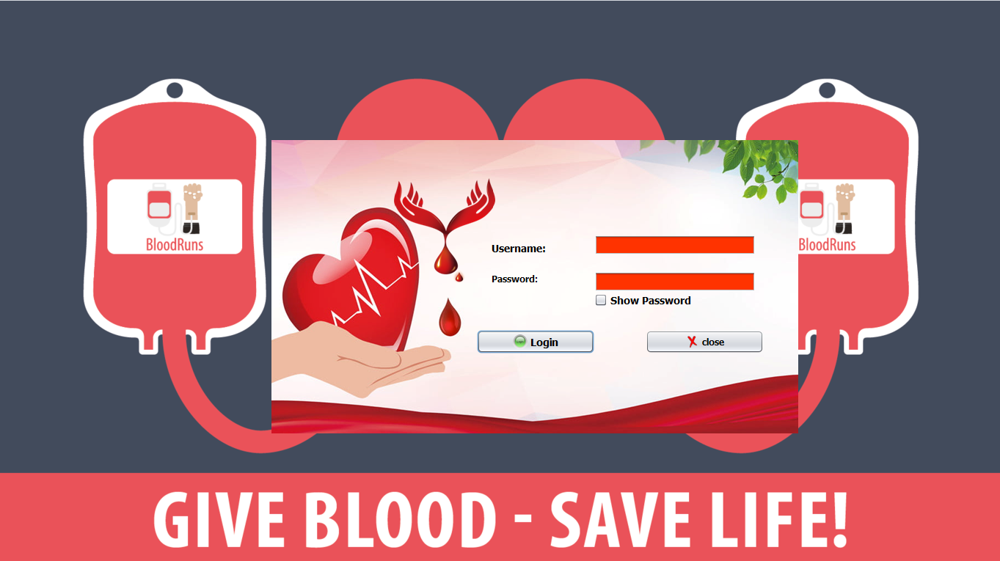
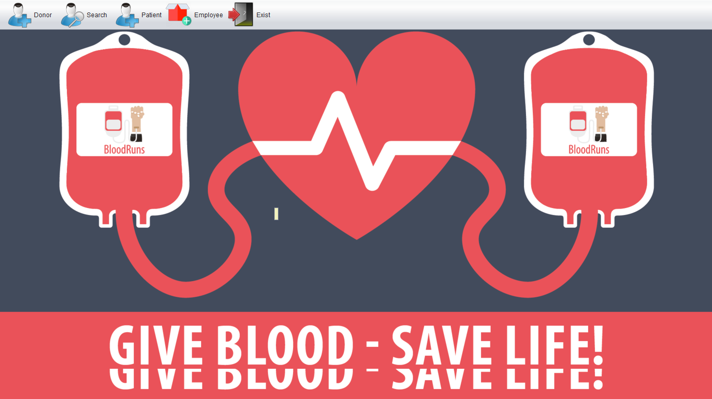
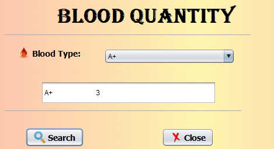

# 🩸 Blood Bank Management System

A desktop application built in **Java (Swing)** that digitizes the day-to-day operations of a blood bank — managing donors, patients, hospitals, employees, and blood inventory through a simple graphical interface backed by a **MySQL/MariaDB** database.


---

## Table of Contents

- [About the Project](#about-the-project)
- [Screenshots](#screenshots)
- [Features](#features)
- [Tech Stack](#tech-stack)
- [Quick Start](#quick-start)
  - [Prerequisites](#prerequisites)
  - [Installation](#installation)
- [Repository Structure](#repository-structure)
  - [Architecture Overview](#architecture-overview)
- [Database Structure](#database-structure)
- [Contributing](#contributing)
  - [Code of Conduct](#code-of-conduct)
- [License](#license)
- [Author](#author)

---

## About the Project

The **Blood Bank Management System (BBMS)** is a NetBeans-based Java desktop application designed to help a blood bank manage its core operations, including:

- Registering and managing **donors** and **patients**
- Tracking **blood inventory** by type, quantity, and draw date
- Managing **employees** and their salaries
- Coordinating **blood deliveries and orders** with partner **hospitals**
- Running quick reports such as blood quantity by type, hospital patient counts, and top-earning employees

It was built as an academic/portfolio project to demonstrate a full desktop **MVC (Model–View–Controller)** application backed by a relational database.

## Screenshots

**Login Page**



**Dashboard**



**Blood Quantity Overview**



## Features

- 🔐 **Login screen** to authenticate access to the system
- 🏠 **Home dashboard** for navigating all system modules
- ➕ **Add new donor** with personal details and contact info
- ➕ **Add new employee** with position and salary
- 🗑️ **Delete donor** records
- ✏️ **Update patient details**, including blood type and quantity requested
- 🩸 **Blood quantity view** to check current stock by blood type
- 🏥 **Hospital count** report, showing how many patients each hospital serves
- 💰 **Max salary** report to identify top-paid employees
- 🔎 **Same donor blood** and **same blood type** lookup queries
- 📋 **Blood requests** module for patients requesting a blood type/quantity

## Tech Stack

- **Language:** Java
- **UI Framework:** Java Swing (NetBeans GUI Builder — `.form` files)
- **IDE / Build:** Apache NetBeans, Ant (`build.xml`)
- **Database:** MySQL / MariaDB
- **Connectivity:** JDBC (`java.sql`)
- **Architecture:** MVC (Model – View – Controller)

## Quick Start

### Prerequisites

Make sure you have the following installed before running the project:

- **JDK 8+**
- **Apache NetBeans IDE** (recommended, since the project ships with NetBeans project files)
- **MySQL Server** or **MariaDB** (tested with MariaDB 10.4)
- **phpMyAdmin** (optional, for importing the database dump visually)

### Installation

1. **Clone the repository**

   ```bash
   git clone https://github.com/AzzamElHaffar/Blood-Bank-Management-System.git
   ```

2. **Import the database**

   - Start your MySQL/MariaDB server.
   - Create a database and import the provided SQL dump (`blood_bank_system.sql`):

   ```bash
   mysql -u root -p < blood_bank_system.sql
   ```

   Or, using phpMyAdmin: go to **Import** → select `blood_bank_system.sql` → **Go**.

3. **Configure the connection**

   The app connects to the database using JDBC in `src/controller/Controller.java`:

   ```java
   connection = DriverManager.getConnection(
       "jdbc:mysql://localhost:3306/blood bank system", "root", "");
   ```

   Update the host, database name, username, and password here if your local setup is different.

4. **Open and run the project in NetBeans**

   - Open NetBeans → **File → Open Project** → select the cloned folder.
   - Right-click the project → **Clean and Build**.
   - Run the project (the login screen will launch first).

## Repository Structure

```bash
Blood-Bank-Management-System/
├── assets/
│   └── screenshots/          # UI screenshots used in this README
├── nbproject/                # NetBeans project configuration & build metadata
├── src/
│   ├── controller/
│   │   └── Controller.java   # Handles all JDBC/database operations
│   ├── model/
│   │   ├── Blood.java
│   │   ├── BloodBank.java
│   │   ├── Delivers.java
│   │   ├── Donates.java
│   │   ├── Donor.java
│   │   ├── Employee.java
│   │   ├── Hospital.java
│   │   ├── Order.java
│   │   └── Patient.java       # Plain data model classes mirroring DB tables
│   └── view/
│       ├── LogInFrame.java / .form        # Login screen
│       ├── WelcomeFrame.java / .form      # Landing/welcome screen
│       ├── HomeFrame.java / .form         # Main dashboard
│       ├── addNewDonor.java / .form       # Register a donor
│       ├── addNewEmployee.java / .form    # Register an employee
│       ├── DeleteDonor.java / .form       # Remove a donor
│       ├── updateDetailsPatient.java / .form  # Edit patient details
│       ├── BloodQuantity.java / .form     # View blood stock
│       ├── HospitalCount.java / .form     # Patients per hospital report
│       ├── MaxSalary.java / .form         # Top salary report
│       ├── SameDonorBlood.java / .form    # Donors with same blood
│       ├── Same_BloodType.java / .form    # Filter by blood type
│       └── request.java / .form           # Blood request module
├── Donor.txt                 # Sample/exported donor data
├── Patient.txt                # Sample/exported patient data
├── build.xml                  # Ant build script
├── manifest.mf                 # JAR manifest
└── blood_bank_system.sql       # Full database schema + seed data
```

### Architecture Overview

The project follows a simple **MVC** pattern:

- **Model** — plain Java classes (`Blood`, `Donor`, `Patient`, `Employee`, `Hospital`, `BloodBank`, `Order`, `Donates`, `Delivers`) that mirror the database tables and carry data between the view and controller.
- **View** — Swing `JFrame` screens generated with the NetBeans GUI Builder (`.form` + `.java` pairs) that handle all user interaction.
- **Controller** — a single `Controller.java` class that opens a JDBC connection to MySQL/MariaDB and executes the SQL needed to add, update, delete, and query donors, patients, and employees.

## Database Structure

The system uses a relational database named **`blood bank system`**, provided as a ready-to-import SQL dump (`blood_bank_system.sql`). It consists of 8 tables:

| Table | Description | Key Columns |
|---|---|---|
| **`bloodbank`** | Stores blood bank branch info | `B_ID` (PK), `B_Name`, `B_Address`, `B_Number` |
| **`donor`** | Stores donor personal details | `D_ID` (PK), `D_Fname`, `D_Lname`, `D_Gender`, `D_Address`, `D_Number`, `D_Age` |
| **`blood`** | Blood units drawn from each donor | `D_ID` (PK/FK → `donor`), `Blood_Type`, `Blood_Quantity`, `Blood_Cost`, `Blood_Draw_Date` |
| **`donates`** | Many-to-many link between donors and blood banks | `B_ID` (FK → `bloodbank`), `D_ID` (FK → `donor`) — composite PK |
| **`patient`** | Stores patient details and their blood request | `P_ID` (PK), `P_Fname`, `P_Lname`, `P_Gender`, `P_Address`, `P_Age`, `P_Number`, `P_BloodType_Request`, `P_BloodQuantity` |
| **`hospital`** | Hospital directory | `H_ID` (PK), `H_Name`, `H_Address`, `H_Number` |
| **`deliver`** | Many-to-many link between patients and hospitals | `P_ID` (FK → `patient`), `H_ID` (FK → `hospital`) — composite PK |
| **`orders`** | Blood orders placed by hospitals to a blood bank | `B_ID` (FK → `bloodbank`), `H_ID` (FK → `hospital`) — composite PK |
| **`employee`** | Blood bank staff records | `E_ID` (PK), `E_Fname`, `E_Lname`, `E_Address`, `E_Age`, `E_Position`, `E_Salary`, `B_ID` (FK → `bloodbank`) |

**Relationships**

- A **donor** can donate to multiple **blood banks**, and a blood bank can receive from multiple donors → resolved via the `donates` junction table.
- Each **donor** has an associated `blood` record (blood type, quantity, cost, draw date) linked by `D_ID`.
- A **patient** can be delivered blood at multiple **hospitals**, and a hospital can serve multiple patients → resolved via the `deliver` junction table.
- A **hospital** can place multiple **orders** to a blood bank, and a blood bank can fulfill multiple hospital orders → resolved via the `orders` junction table.
- Each **employee** works at one **blood bank** (`B_ID` foreign key).

All foreign keys use `ON DELETE CASCADE ON UPDATE CASCADE`, so removing a parent record (e.g., a donor or hospital) automatically cleans up its related rows.

To set up the database, simply import `blood_bank_system.sql` into MySQL/MariaDB as shown in the [Installation](#installation) section.

## Contributing

Contributions are welcome! To contribute:

1. **Fork** the repository.
2. **Clone** your fork:
   ```bash
   git clone https://github.com/<your-username>/Blood-Bank-Management-System.git
   ```
3. **Create a feature branch**:
   ```bash
   git checkout -b feat/your-feature-name
   ```
4. Make your changes and **commit** with a clear message (`feat:`, `fix:`, `docs:`, `refactor:` prefixes are appreciated).
5. **Push** your branch and open a **Pull Request** describing what you changed and why.

### Code of Conduct

- Be respectful and constructive in discussions and reviews.
- Welcome feedback and differing viewpoints.
- Avoid discriminatory or offensive language.
- Focus on the code and the problem, not the person.
- Credit others' contributions where due.


## Contact

**Azzam El Haffar** – [GitHub Profile](https://github.com/AzzamElHaffar)

Project Repository: [Blood-Bank-Management-System](https://github.com/AzzamElHaffar/Blood-Bank-Management-System)
